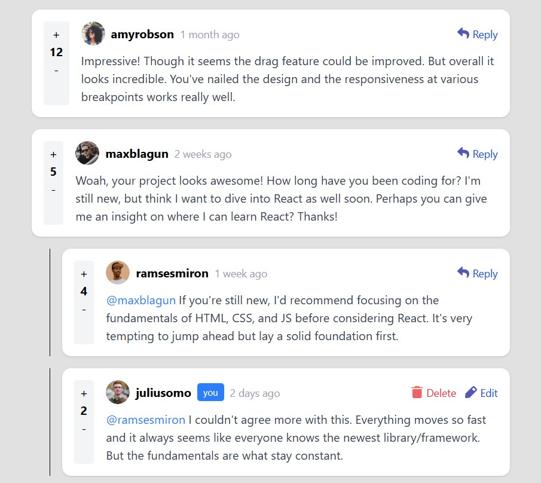

# Interactive Comments 💬

Responsive interactive comments section built with React and Tailwind CSS.

## Overview

This project simulates a modern comment system with nested replies and interactive UI features.

Users can:
- Add comments
- Reply to comments
- Edit comments
- Delete comments
- Interact with nested replies
- Use the application on desktop and mobile devices

## Screenshot

## Built With

- React
- Tailwind CSS
- Vite

## Features

- Fully responsive layout
- Reusable components
- Dynamic comment rendering
- Modal interactions
- State management with React hooks
- Clean modern UI

## Installation

npm install
npm run dev

## Live Demo

(https://terezl.github.io/interactive-comments/)

## Author

GitHub: https://github.com/TerezL
